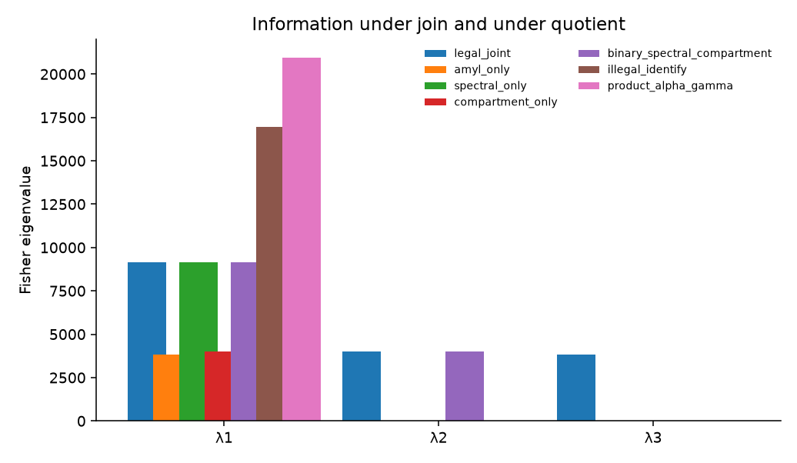
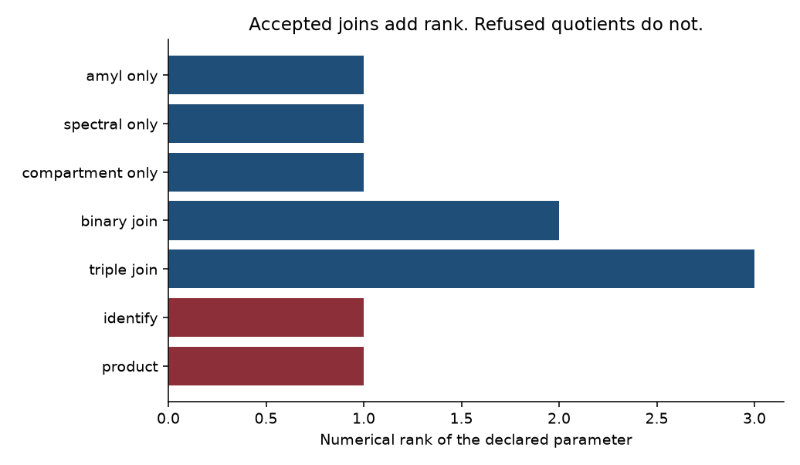
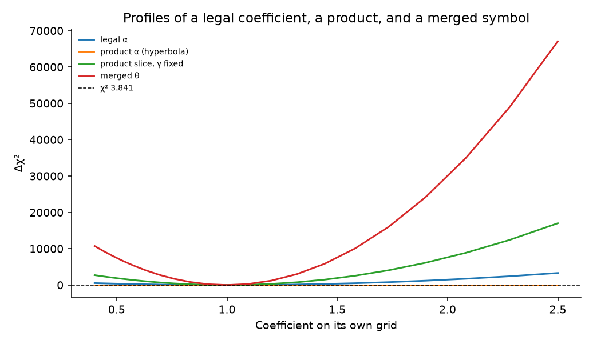

# Composing named observation channels into a Disease Profile without illegal merge into Θ

**Thesis #22. Computational research thesis**  
**Depends on:** Thesis #3 (Disease Profile), Thesis #8 (named observation channel), Thesis #15 (multi-observation profile; merged θ refused)  
**Author:** Kelechi Emeka Ogbonna  
**Correspondence:** kelechiogbonna300@gmail.com · https://github.com/cloudynirvana/thesis-22-observation-channel-profile-composition  
**Date:** 21 September 2026  
**Format:** B.Sc. project chapters (Nile University style), written as a computational methods manuscript  
**Status:** A composition contract, a validator, and a seeded linear toy. Not a measurement and not a therapy.  
**Citation style:** numbered Vancouver. A `doi:` field appears only where Crossref returned the record.  
**DOI:** none for this document. Do not invent one.

---

## Title page

**COMPOSING NAMED OBSERVATION CHANNELS INTO A DISEASE PROFILE WITHOUT ILLEGAL MERGE INTO Θ**

BY

**KELECHI EMEKA OGBONNA**

A COMPUTATIONAL RESEARCH THESIS  
(IN-SILICO COMPOSITION OF NAMED OBSERVATION MAPS)

SUBMITTED AS A CITEABLE MANUSCRIPT FOR JOURNAL / THESIS HANDOFF

PROJECT CONFLUENCE  
INDEPENDENT COMPUTATIONAL RESEARCH

SUPERVISOR: not appointed for this deposit

SEPTEMBER 2026

---

## Declaration

I, Kelechi Emeka Ogbonna, declare that this computational research thesis was carried out by me. The ranks, profiles, estimates, and validator reports were produced by `sim/compose_profile.py` at seed 20260922. They are not wet-lab measurements and not patient outcomes. No DOI, ORCID, or journal acceptance was invented for this document. The 2022 papaya assay table was not copied. The loadings of Thesis #15 were not reused.

_________________________ _______________________  
Kelechi Emeka Ogbonna Date

---

## Abstract

When do separately named observation channels compose into a Disease Profile without illegally merging into a single therapeutic parameter θ?

Thesis #3 already exports a Disease Profile [1]. Thesis #8 already names one observation channel and keeps the coefficient out of Θ [2]. Thesis #15 already stores three channels in one file and refuses a file that writes them as one symbol [3]. None of those deposits states the join. This one does. The legal operator is disjoint union. The composition record names the factors, leaves the therapeutic list empty, and names neither a quotient nor a combiner.

On a five-preparation linear toy the joint Fisher matrix is diagonal. Its entries are 3819.4444, 9155.5556, and 4000, so the rank is 3. Each channel alone has rank 1. A binary join has rank 2. Identifying the three coefficients as one symbol produces θ̂ = 1.3252986. The generating values are α = 0.62, β = 1.15, and γ = 2.40. The profile of the merged symbol is closed and excludes each of those values. The unweighted mean of the three coefficients is 1.39, which is a different wrong number. The product αγ = 1.488 has Fisher rank 1 and a flat profile along the hyperbola that holds the product fixed. A slice that freezes one factor of the product looks closed.

The JSON Schema of the legal contract accepts a repeated channel identifier and a join across two disease-class identifiers. The composition rules refuse both. A DOI that is not on the Crossref snapshot used for the profile is refused. The loadings are synthetic. No assay table is stored.

Research only. Not a medical device, not clinical decision support, not a dose, and not a cure.

---

## Keywords

observation channel; Disease Profile; disjoint union; quotient; profile likelihood; Fisher information; composition; research only

---

## Table of Contents

DECLARATION  
ABSTRACT  
Table of Contents  
List of tables and figures  

CHAPTER ONE. INTRODUCTION  
1.1 Background to the study  
1.2 STATEMENT OF RESEARCH PROBLEM  
1.3 JUSTIFICATION OF STUDY  
1.4 AIM AND OBJECTIVES OF THE STUDY  
1.5 SIGNIFICANCE OF THE STUDY  
1.6 SCOPE OF THE STUDY  

CHAPTER TWO. LITERATURE REVIEW  
2.1 A channel is a map  
2.2 A profile is an export  
2.3 A multi-observation file is not yet a join  
2.4 Fusion can name the wrong parameter  
2.5 A profile likelihood can see a quotient  
2.6 Objects do not compose themselves  

CHAPTER THREE. MATERIALS AND METHODS  
3.1 Design  
3.2 Channels, factors, and the profile shell  
3.3 Disjoint union  
3.4 Refused operators  
3.5 Fisher information of the join  
3.6 Profiles  
3.7 Validator  
3.8 What was not done  

CHAPTER FOUR. RESULTS  
4.1 Three legal files  
4.2 Six refused files  
4.3 Rank adds under disjoint union  
4.4 The identified symbol is a weighted average  
4.5 The product leaves a flat profile  
4.6 One noisy draw  

CHAPTER FIVE. DISCUSSION, CONCLUSION AND RECOMMENDATION  
5.1 Discussion  
5.2 Conclusion  
5.3 Recommendation  

REFERENCES  
DISCLAIMER  

---

## List of tables and figures

**Table 3-1.** Channels in the legal bundle.  
**Table 3-2.** Coefficients and loadings.  
**Table 3-3.** Non-parameters required of every legal file.  
**Table 4-1.** Validator outcomes.  
**Table 4-2.** Fisher spectra.  
**Table 4-3.** Profile calls.

**Figure 4-1.** Fisher eigenvalues under join and under quotient.  
**Figure 4-2.** Rank against acceptance.  
**Figure 4-3.** Profiles of a legal coefficient, a product, and a merged symbol.

Figures are diagnostics from `sim/compose_profile.py`. They are not measured assays.

---

# CHAPTER ONE

## 1.0 INTRODUCTION

### 1.1 Background to the study

A Disease Profile, in the sense already fixed, is a versioned export of a thinking-lab board for a disease class [1]. It is not a chart, not a parameter table, and not a prediction. A named observation channel, in the sense already fixed, is a map from a state, or from a declared preparation, to a reading [2]. The coefficient of that map is not a member of Θ. A multi-observation profile, in the sense already fixed, can hold several such maps in one file and can refuse a file that collapses them [3]. The undergraduate papaya assay that supplied the historical motive for the channel remains a separate wet-lab study [4]. It is not re-tabulated here. The parent gate, that a knowledge record is not a coefficient, is also already stated [5].

What those deposits do not state is the algebra of combination. One can possess a profile object, a channel, and a worked multi-channel file, and still have no rule for the act of joining. The dangerous act is ordinary. Two readings are placed on one page. A symbol is reused because the page has one title. A product is formed because both factors were "part of the platform." An average is reported because a reader asked for one number. Each of those acts is a function from records to records. Only some of the functions return a Disease Profile.

May's warning applies before any of the biology is invoked. An equation borrowed from a neighbouring field still has to be the equation the prose describes [6]. Saltelli and colleagues make the same demand of any model that might be mistaken for a decision [7]. FAIR principles say that a digital object should be findable and reusable [8]. They do not say that two reusable objects, once concatenated, remain the kind of object each was. Structural identifiability asks whether a parameter can be recovered from a chosen output [9]. A profile likelihood asks whether a one-dimensional slice of that recovery is flat [10]. Data fusion asks a third question, often quietly: which parameter the fused reading is even about [11]. This thesis treats the join as that third question, written as an operator on profile files.

### 1.2 STATEMENT OF RESEARCH PROBLEM

When do separately named observation channels compose into a Disease Profile without illegally merging into a single therapeutic parameter θ?

The working form is narrow. There is a profile shell taken from Thesis #3, not edited [1]. There are named maps in the sense of Thesis #8, including one amylase-shaped map whose coefficient is not an inhibition percentage [2]. There is a second factor that carries two further maps, of the kind Thesis #15 kept apart, with coefficients declared here and not copied from that deposit [3]. The legal operator is disjoint union. The illegal operators are identification, a product, an arithmetic mean, promotion of one coefficient into θ, composition of a channel with itself, and a join across two disease-class identifiers.

The numerical witness is a linear Gaussian toy with known loadings. It is there to show that the legal join and the illegal quotients are different calculations. A negative sentence is part of the result. The schema that types a legal file does not, by itself, refuse every illegal file.

### 1.3 JUSTIFICATION OF STUDY

Thesis #8 had to exist before a channel could be a factor. Thesis #15 had to exist before a reader could see that three channels in one file are not the same object as one symbol. Thesis #3 had to exist before either of those files could claim to be a profile. The missing sentence is the composition rule. Without it, a later manuscript can "include" the channel and the multi-observation file by pasting both into a therapeutic θ and still cite all three priors.

The study is justified as a separation of three sentences that are easy to run together: a definition of disjoint union, a refusal of named quotients, and a biological claim about a particle or an enzyme. Only the first two are attempted [6,7]. Strong inference, in Platt's sense, asks for an outcome that would have failed [12]. Box's line is the same demand in milder language: the useful model is the one that can be wrong in a specified way [13]. Here the specified failure is a validator that accepts a merged θ, or a Fisher rank that does not add when the operator says the channels were kept apart.

The study is not justified as a device, a dose, or a claim that any channel name is a treated cohort [7].

### 1.4 AIM AND OBJECTIVES OF THE STUDY

The aim is to state the legal join of named observation channels as a falsifiable computational object on the profile contract in Chapter Three, and to show that the illegal operators are different objects on the same toy.

The objectives are:

1. Define a channel, a factor, and a disjoint union that extends the Thesis #3 profile without editing it, and without reissuing the Thesis #15 schema.
2. Define the refused operators: identification, product, arithmetic mean, promotion, self-composition, and cross-class join.
3. Give the Fisher matrix and the profile likelihood of the legal tuple, of the identified scalar, and of the product.
4. Implement a validator that accepts the legal files and refuses the illegal files, and record where the JSON Schema is silent.
5. Keep clinical use, dosing, and any reading of a legal file as a therapeutic parameter outside the aim.

Non-aims. Re-tabulating the 2022 assay. Re-fitting Thesis #15. Estimating a kinetic θ. Ranking preparations as treatments. Interpreting a channel name as a tissue or a patient.

### 1.5 SIGNIFICANCE OF THE STUDY

The useful product is a join that can fail in public. If the bundle and the three singletons do not carry the same channel identifiers, the associativity claim fails on this deposit. If the identified estimate equals one of the generating coefficients, the claim that identification smuggles a different parameter fails on this design. If a repeated identifier is accepted, the uniqueness rule fails. Those checks can be rerun without accepting a clinical sentence [6,7].

There is a second product inside the same script. The schema of a legal file can still validate a file the composition rules refuse. That split is what stops a green schema check from being promoted into a legal profile.

### 1.6 SCOPE OF THE STUDY

In scope. The algebra of named maps on one disease-class identifier. A five-row design. One Gaussian variance. One constant-proxy chi-square line at 3.841. The validator rules in Section 3.7. One noisy draw at seed 20260922.

Out of scope. Synthesis, cell assays, and animal data. The numerical table of the 2022 papaya project [4]. The loadings and the estimate published in Thesis #15 [3]. A tumour ordinary differential equation. Laser fluence, infusion rate, and body weight. A regulatory use.

---

# CHAPTER TWO

## 2.0 LITERATURE REVIEW

### 2.1 A channel is a map

Bellman and Åström asked when the parameters of a linear state model can be recovered from an input-output record [9]. The question is about the map, not about a second copy of the state that one has decided to call a treatment. Cobelli and DiStefano reviewed the ambiguities that remain when the output does not separate parameters that enter only as a product or a ratio [14]. Hermann and Krener gave the local geometric version for nonlinear control systems: observability is a property of the output map [15]. Later surveys compare algebraic and differential tests on systems-biology models [16,17]. Software now exists for those tests on ODE models and on SBML files [18–21]. Compartment models have their own identifiability catalogues [22]. The practical half of the literature asks which of the structurally distinct parameters remain distinguishable at realistic noise [10,23].

Gutenkunst and colleagues showed that sloppy spectra are common: many directions of a parameter space barely move the output [24]. A sloppy direction is not, by itself, a merged therapeutic parameter. It is a warning that a fit can look sharp along a plotted axis while a combination stays free. Thesis #8 used that family of facts on a frozen metabolic toy. The legal object was a named map. The illegal object was an inhibition fraction written into the vector field [2]. This thesis does not recompute that Fisher table. It takes the channel as an atom that a join may either keep or damage.

An amylase-shaped map, in the present notation, is a declared saturating function of a substrate coordinate. The declaration is the point. The coefficient is not an IC50, and no percent inhibition from the 2022 project is stored [4].

### 2.2 A profile is an export

Wilkinson and colleagues asked that scientific objects be findable, accessible, interoperable, and reusable [8]. Interoperability of bioscience records has a longer argument: a shared table is not yet a shared meaning [25]. MIRIAM asked model annotations to point at real identifiers [26]. MIASE asked a simulation experiment to say which model, which changes, and which outputs were used [27]. SBML is one medium for the model itself [28]. Controlled vocabularies in systems biology, the Ontology for Biomedical Investigations, and the OBO Foundry are attempts to keep those identifiers from drifting [29–31]. Bechhofer and colleagues made the limit explicit. Linked data can connect records and still fail a scientist, because the connection is not the experimental claim [32].

JSON has a grammar [33,34]. JSON Schema can require a field and forbid an extra one. PEtab and Data2Dynamics show the same habit in parameter estimation: the estimation problem is a specified object, not a notebook that happens to contain a fit [35,36]. Minimum information for bio–nano experiments is a reporting list [37]. A reporting list can demand that a particle and a readout both be described. It does not decide whether those descriptions are one parameter.

Thesis #3 is the profile this deposit extends. Identity, four questions, observables, mechanisms, non-parameters, hypotheses, citations, and a fixed disclaimer are already required [1]. Schema version `1.0.0` is the parent. This manuscript adds a composition record. It does not publish a second parent contract.

### 2.3 A multi-observation file is not yet a join

Thesis #15 put three channels — a spectral contrast, a compartment indicator, and a damage readout — into one profile, left θ empty, and refused a file in which those channels shared a symbol [3]. That refusal is a special case of identification. It is not a general operator. The file does not say what happens if a fourth channel, of the Thesis #8 kind, is attached. It does not say whether the attachment may be associated in either order. It does not say whether a product of two of its coefficients, with the symbols still distinct, is a legal profile that merely "summarises" them.

Baez and Stay describe composition of processes by juxtaposition of wires [38]. The metaphor is limited, and this thesis does not import a category-theoretic theorem. The useful fragment is small. Placing two maps side by side is not the same operation as soldering their outputs onto one wire. Bloch's review of combination operators makes a related point in sensor fusion: a conjunctive rule, a disjunctive rule, and an averaging rule are different functions, and they answer different questions [39]. A profile that does not name the function has not composed anything. It has only been longer.

### 2.4 Fusion can name the wrong parameter

Hall and Llinas introduced multisensor fusion as the construction of a picture from heterogeneous readings [40]. Reviews since then catalogue architectures, from raw-data fusion to decision fusion [41,42]. The catalogues are about engineering performance. They are not a licence to treat every fused scalar as the parameter each sensor was measuring.

Bareinboim and Pearl state the data-fusion problem in causal language. Datasets collected under different regimes do not automatically estimate the same effect, and a transport formula is an explicit assumption, not a property of concatenation [11,43]. The present toy is not a causal transport theorem. It is a smaller illustration of the same discipline. If three linear maps are replaced by one symbol, the least-squares value of that symbol is a design-weighted average of the three coefficients. The weights move when the loadings move. A mechanism that did not move is still assigned a new number. That is what it means, here, for a merge to smuggle θ.

### 2.5 A profile likelihood can see a quotient

Raue and colleagues used the profile likelihood to separate a parameter that is practically pinned from a direction that can run away while the output stays put [10]. Kreutz and colleagues restated the method for systems-biology models [44]. Maiwald and colleagues used the flat directions as a reduction tool, with the warning that a reduced model can hide the combination it deleted [45]. Eisenberg and Hayashi showed that subset profiling can expose identifiable combinations even when the separate factors are not identifiable [46]. Venzon and Moolgavkar gave an earlier computational route to profile-likelihood intervals [47]. Catchpole and Morgan gave tests for parameter redundancy, the algebraic fact that a model can be rewritten with fewer parameters than its notation suggests [48].

Fisher's information is the curvature of that story at a point [49]. Rao's bound says what a regular unbiased estimator cannot beat if the model is the one being fitted [50]. The bound is not a warrant for a different model. In this thesis the illegal scalar has a large information number and a small formal standard error. The number is information about the weighted average. It is not information about α, β, or γ separately. A closed profile centred on the wrong value is the plot of that mistake.

### 2.6 Objects do not compose themselves

Kitano's sketch of systems biology asked for a system-level account rather than a single privileged reaction [51]. Noble's biological relativity refuses a privileged causal level [52]. Neither paper is a composition calculus for profile files, and neither is used here as a clinical claim. They are cited because a cross-scale sentence is exactly where an illegal merge hides. "The channel, the compartment, and the spectrum are one system" can be a reason to keep three maps, or an excuse to delete two of them. The operator has to say which.

Open-research and reproducibility manifestos ask that a result be checkable by someone who was not in the room [53,54]. Ioannidis argued that a literature of flexible analyses will publish false findings at a high rate [55]. Those arguments do not prove any particular file false. They do justify putting the refusal in the repository rather than in a paragraph that a later user can skip. Box's aphorism and Platt's strong inference were already used as the standard for a failing check [12,13]. Akaike's criterion is a reminder of a neighbouring temptation: a scalar score can rank models and still not be a parameter of any of them [56]. An information criterion is not a disjoint union. A disjoint union is not a dose.

---

# CHAPTER THREE

## 3.0 MATERIALS AND METHODS

### 3.1 Design

The deposit has two layers. The first is a set of profile files and a validator. The second is a linear Gaussian calculation that shows what the legal and illegal operators do to information. Both layers are produced by `sim/compose_profile.py`. The seed is 20260922. It governs the single noisy draw. The noiseless ranks do not use it.

Schema `1.2.0-compose` is local to this repository. It extends Disease Profile schema `1.0.0` [1]. It does not edit schema `1.1.0-multiobs` [3]. `additionalProperties` is forbidden. A legal file must name the operator `disjoint_union`, set the quotient and the combiner to null, and leave θ empty.

The disease identifier on every legal file is `named-channel-class-unspecified`. It names a class of maps. It does not name a person, a stage, or a hospital record.

### 3.2 Channels, factors, and the profile shell

A channel is a record: an identifier, a symbol, a map-coefficient name, a sentence saying what is observed, the status `not_in_theta`, a factor identifier, a source prior, and a refusal sentence. A factor is a named bundle of channel identifiers, carrying one source prior and one disease-class identifier. A profile is the Thesis #3 shell plus the channels plus one composition record.

**Table 3-1.** Channels in the legal bundle.

| Channel | Symbol | Coefficient | Prior | What the channel records |
| --- | --- | --- | --- | --- |
| `ch_amyl_map` | y_A | α | T08 | A declared saturating map of a substrate coordinate. Not an inhibition percentage. |
| `ch_spectral` | y_S | β | T15 | A declared spectral contrast. Not a copied reporter loading. |
| `ch_compartment` | y_C | γ | T15 | A declared compartment indicator. Not a vesicle count. |

The legal bundle uses two factors. One factor holds the amylase-shaped channel. The other holds the spectral and compartment channels together, which is the shape of "attach Thesis #8's kind of channel to a multi-observation factor." A second legal file splits the same three channels into three singleton factors. A third legal file keeps only the spectral and compartment channels. Binary composition is allowed. A one-channel file is not a composition under this schema, because a join needs two factors. Thesis #8 remains the place where a single channel is defined [2].

The four answers record a methods researcher, the unspecified class, an in-silico regime, and the stuck point: the portfolio has the objects and not the join. One admitted mechanism says the symbols stay distinct, and it carries a falsifier: a preparation series whose loadings differ and which is nevertheless fitted by one coefficient. A second mechanism, `M-ONE-THETA`, says one therapeutic parameter accounts for every channel. Its status on a legal file is `refused`. Admitted hypotheses carry `parameter_status: forbidden_to_enter_theta`.

### 3.3 Disjoint union

Write the channels as C_A, C_S, and C_C. Disjoint union is the operator

C_A ⊔ C_S ⊔ C_C

whose result is the set of those records, together with a composition object that says the operator was disjoint union, the quotient was null, and the combiner was null. The set of channel identifiers does not depend on parenthesisation:

(C_A ⊔ C_S) ⊔ C_C = C_A ⊔ (C_S ⊔ C_C) = C_A ⊔ C_S ⊔ C_C

as sets of identifiers. The bundle, which is C_A joined to the already paired factor (C_S, C_C), is required to carry the same identifiers as the three singletons. Order of listing is part of the file. The identity check used here is equality of the identifier lists as written in the two legal three-channel files, which were built in the same order, and equality of the underlying sets for the associative comparison.

No coefficient is created by the union. In particular, the union does not define α+β, αβ, or (α+β+γ)/3. Those expressions are other operators. They are specified in the next section so that a file cannot perform them under a blank name.

### 3.4 Refused operators

Identification replaces every symbol and every map coefficient by one name, θ, sets every channel status to `in_theta`, and stores that name in the therapeutic list. The composition operator is `identify`. On the toy the means that were

y_A,i = α a_i, &nbsp; y_S,i = β b_i, &nbsp; y_C,i = γ c_i

become

y_A,i = θ a_i, &nbsp; y_S,i = θ b_i, &nbsp; y_C,i = θ c_i.

The least-squares estimate on noiseless data is the design-weighted average

θ̂ = (α ‖a‖² + β ‖b‖² + γ ‖c‖²) / (‖a‖² + ‖b‖² + ‖c‖²).

The weights are properties of the loadings.

The product operator leaves the channel symbols looking distinct and writes π = αγ into θ. The observed score on the toy is

m_i = α γ a_i c_i.

Any pair with the same product writes the same m. The spectral coefficient β does not enter m. The join has already dropped a channel.

The arithmetic-mean operator writes θ_mean into the therapeutic list. On the coefficients themselves the unweighted mean is (α+β+γ)/3. That number is reported because it is not θ̂. Two illegal summaries of the same three numbers need not agree. Neither is required to equal a generating value.

Promotion keeps the operator string `disjoint_union` and changes one channel, the amylase-shaped map, to `in_theta`, placing α in the therapeutic list. The point of this file is that the operator string is not self-certifying.

Self-composition repeats `ch_spectral`. Cross-class join assigns the two factors different disease identifiers. Both files can still satisfy the local types in the JSON Schema. They fail the partition rule or the disease-match rule.

### 3.5 Fisher information of the join

Preparation i has known loadings a_i, b_i, and c_i. There are five preparations and four replicates. Observations are Gaussian with known variance σ² = 0.06². Because each coefficient appears in only one channel, the legal Fisher matrix is diagonal:

F_αα = (n/σ²) ‖a‖², &nbsp; F_ββ = (n/σ²) ‖b‖², &nbsp; F_γγ = (n/σ²) ‖c‖².

**Table 3-2.** Coefficients and loadings. Dimensionless concept units.

| Item | Values |
| --- | --- |
| α, β, γ | 0.62, 1.15, 2.40 |
| a (amylase-shaped map) | 0.25, 0.50, 0.75, 1.00, 1.25 |
| b (spectral contrast) | 1.80, 0.40, 1.80, 0.40, 1.20 |
| c (compartment indicator) | 0.30, 0.90, 0.30, 1.50, 0.60 |

The first loading rises. The second alternates. The third follows neither pattern. The three designs are different experiments sharing a page. They are not the four-preparation loadings of Thesis #15 [3].

A single-channel analysis zeros the unused diagonal entries. A binary analysis of the spectral and compartment channels zeros the α entry. Rank is the count of eigenvalues above 10⁻⁸ times the largest eigenvalue of that matrix. Where a legal diagonal entry is positive, the reciprocal square root is stored as a local Cramér–Rao sketch under the Gaussian model. The sketch is not a posterior and not a laboratory precision [50].

The identified scalar has a one-by-one information equal to the sum of the three legal diagonals. Stacking channels under one symbol adds information about that symbol. It does not create information about the differences among α, β, and γ.

For the product score the sensitivities ∂m/∂α and ∂m/∂γ are parallel: both are proportional to a∘c, the entrywise product of the loadings. The two-by-two Fisher matrix has rank 1. The null direction is proportional to (α, −γ), the local move that holds the product fixed. The cosine of the numerical null vector with that direction is part of the check.

### 3.6 Profiles

A profile fixes one coefficient on a geometric grid and records the rise in weighted residual sum of squares above the least-squares minimum [10]. The grid runs from 0.40 to 2.50 times the reference value, with 21 geometric nodes, and the reference is inserted if it is not already a node. The chi-square threshold for one interesting parameter is 3.841. A profile is called flat when the spread of Δχ² on the grid is below 0.5. It is called closed when both endpoints exceed the threshold. Otherwise it is called open. Flat is tested first.

For a legal coefficient the other channels do not enter the residual, so there is nothing to refit. Δχ²(κ) = F_κκ (κ − κ₀)². The profile of α computed from the spectral channel alone is the contrast that should be flat: α does not appear in y_S. The same is true of γ on the amylase-shaped channel.

The product profile of α refits γ as π/α. On noiseless data the residual stays zero along that hyperbola. The slice freezes γ at 2.40 and moves α. The slice is reported because it is the plot that makes a fused score look identified [10,46].

The illegal profile is centred at θ̂, not at α, β, or γ. Δχ² at each generating value is stored. A large information number and a centre away from every generating value can occur together.

Noiseless data equal the model mean. Noisy data are one draw at the seed above, with four replicates. One draw is not a sampling distribution of the profile.

### 3.7 Validator

`sim/compose_profile.py` builds the files, writes them, and applies one rule list. A legal file must extend Disease Profile schema `1.0.0`, answer the four questions, carry at least two channels, give each channel its own identifier, symbol, and map coefficient, set every status to `not_in_theta`, leave θ empty, set the operator to `disjoint_union`, leave the quotient and the combiner null, and partition the channel identifiers across the factors without repetition. Every factor source must be one of `T08`, `T15`, or `declared_map`. Every factor disease identifier must equal the profile's disease identifier. The disease identifier must not contain the substrings `patient`, `mrn`, or `subject`.

**Table 3-3.** Non-parameters required in every legal file.

| Identifier | What stays out of θ |
| --- | --- |
| `merged_therapeutic_theta` | One symbol used as every map coefficient |
| `composition_quotient` | A join that identifies distinct coefficients |
| `product_of_map_coefficients` | A product written as a parameter |
| `arithmetic_mean_of_channels` | A mean written as a parameter |
| `channel_promoted_into_theta` | One channel promoted by the act of joining |
| `cross_disease_join` | A union across two disease-class identifiers |
| `self_composition` | A repeated channel identifier |
| `assay_scalar_as_treatment` | An assay-shaped coefficient copied in as a treatment. No assay table is stored. |

`M-ONE-THETA` must be refused. An admitted mechanism needs a non-empty falsifier. Every admitted hypothesis stays at `forbidden_to_enter_theta`. A DOI field must match the pattern `10.` plus a registrant and must sit on the snapshot of Crossref records consulted for the profile on 21 September 2026. The disclaimer string is fixed. Symbols and map-coefficient names must be identifiers, not arithmetic expressions.

The same documents are checked against `schema/composed_profile.schema.json`. The schema encodes the legal contract, including an empty θ and the constant operator `disjoint_union`. It does not encode uniqueness of channel identifiers across the array, and it does not encode equality of disease identifiers across factors. Those two refusals are expected to be semantic rather than schematic. A synthetic DOI `10.1234/not-a-real-record`, injected into an otherwise legal file and not written to disk, must fail the snapshot rule.

### 3.8 What was not done

No particles were synthesised. The 2022 amylase table was not copied [4]. Thesis #8's ODE sensitivities were not recomputed [2]. Thesis #15's loadings, its estimate, and its Fisher numbers were not reused [3]. No tumour ordinary differential equation was integrated. Global-identifiability software was unnecessary: the maps are linear and the ranks are eigenvalues [18–21]. Papers cited in Chapter Two were not reanalysed. Their DOI strings were checked against Crossref on 21 September 2026. Their experiments were not repeated.

---

# CHAPTER FOUR

## 4.0 RESULTS

### 4.1 Three legal files

The bundle, the three singletons, and the binary spectral–compartment file are accepted. Each has an empty rule list, and each validates against the schema. The bundle and the singletons carry the same channel identifiers, in the same order: `ch_amyl_map`, `ch_spectral`, `ch_compartment`. The associative set comparison also holds. Joining the amylase-shaped channel to the paired factor is the same set of identifiers as joining a spectral–compartment pair to the remaining channel, and the same set as the three singletons.

The binary file is a legal profile with two channels. Composition therefore does not require the three-channel shape of Thesis #15 [3]. It requires a disjoint union of at least two factors, with the refusals of Section 3.4 still in force. θ is empty in all three files. No coefficient was created by the join.

The profile citations carry eight DOI strings, each on the snapshot. Replacing the first of them, in memory, by `10.1234/not-a-real-record` fails `doi_not_in_snapshot`.

### 4.2 Six refused files

**Table 4-1.** Validator outcomes. "Schema" is the JSON Schema of the legal contract. "Rules" are the composition rules. A legal file needs both.

| File | Rules | Schema | Accepted |
| --- | --- | --- | --- |
| Bundle, singletons, binary | none failed | valid | yes |
| Identify | 11 rules, including shared symbols, `in_theta`, nonempty θ, operator `identify` | invalid | no |
| Product | nonempty θ, operator `quotient`, combiner `product`, `M-ONE-THETA` admitted | invalid | no |
| Arithmetic mean | nonempty θ, operator `arithmetic_mean`, combiner set | invalid | no |
| Promote | amylase-shaped status `in_theta`, θ = [α], operator string still `disjoint_union` | invalid | no |
| Self-composition | repeated `ch_spectral`, partition fails | valid | no |
| Cross-class join | factor disease identifiers differ | valid | no |

Identification fails in the way Thesis #15 already illustrated for one materials story, and it fails here as an operator [3]. The product and the mean fail even though the channel symbols can still look private: the damage is in the composition record and in θ. Promotion fails even though the operator string says `disjoint_union`. The string is not a proof.

Self-composition and the cross-class join are the cases the schema misses. Both are invalid as profiles under the rule list. Both are valid as JSON under `composed_profile.schema.json`, because that document checks the type of each factor and does not check the global partition or the agreement of disease identifiers. A green schema check is not a legal join. The rule list is part of the object.

### 4.3 Rank adds under disjoint union

The design energies are ‖a‖² = 3.4375, ‖b‖² = 8.24, and ‖c‖² = 3.6. With n = 4 and σ = 0.06 the legal diagonal is

F_αα = 3819.4444, &nbsp; F_ββ = 9155.5556, &nbsp; F_γγ = 4000.

The off-diagonal entries are zero. The joint eigenvalues are those three numbers, and the rank is 3. The amylase-shaped channel alone has eigenvalues 3819.4444, 0, 0. The spectral channel alone has 9155.5556, 0, 0. The compartment channel alone has 4000, 0, 0. Each has rank 1. The binary spectral–compartment block has rank 2. Rank adds. The Cramér–Rao sketches on the legal diagonal are 0.016180797, 0.010450995, and 0.015811388. Relative to the generating values those sketches are 0.026098059, 0.0090878219, and 0.0065880785. They are local curvatures of this Gaussian model. They are not assay precisions.

**Table 4-2.** Fisher spectra. Eigenvalues are listed in descending order.

| Object | Eigenvalues | Rank |
| --- | --- | --- |
| Legal joint | 9155.5556, 4000, 3819.4444 | 3 |
| Amylase-shaped only | 3819.4444, 0, 0 | 1 |
| Spectral only | 9155.5556, 0, 0 | 1 |
| Compartment only | 4000, 0, 0 | 1 |
| Binary spectral ⊔ compartment | 9155.5556, 4000, 0 | 2 |
| Identified scalar | 16975 | 1 |
| Product α, γ | 20967.765, 0 | 1 |

The identified information, 16975, is the sum of the legal diagonal. The product information is larger than any single legal entry and still has rank 1. A large eigenvalue is not a separated parameter.

**Figure 4-1.** Eigenvalues of the legal joint, the single channels, the binary join, the identified scalar, and the product. Zeros are structural. They are not rounding dust. The figure is a diagnostic from the script.

**Figure 4-2.** Rank of the declared parameter. Blue bars are legal objects, including the single channels, which are factors rather than compositions. Red bars are refused operators. The binary join is rank 2 and accepted. Identification and the product are rank 1 and refused. Acceptance is not a monotone function of rank: a rank-1 channel can be a legal factor, and a rank-1 fused symbol is not a legal composition.

### 4.4 The identified symbol is a weighted average

The noiseless least-squares value is θ̂ = 1.3252986. The weights are 0.22500409 on α, 0.53935526 on β, and 0.23564065 on γ. Most of the weight sits on β because ‖b‖² is the largest design energy. That is a property of the loadings. It is not a ranking of channels, and it would move if the design moved.

The absolute errors are |θ̂ − α| = 0.70529864, |θ̂ − β| = 0.17529864, and |θ̂ − γ| = 1.0747014. None is zero. The unweighted mean of the three coefficients is 1.39, which differs from θ̂ by about 0.065. The mean is the number an arithmetic-mean operator suggests. The weighted average is the number an identification operator actually fits. Both are refused. They are not interchangeable, and neither recovers the tuple (0.62, 1.15, 2.40).

The profile of θ, taken relative to θ̂, is closed. The endpoint values of Δχ² are 10733.461 and 67084.132. Evaluated at the generating coefficients, Δχ² is 8444.1488 at α, 521.63519 at β, and 19605.837 at γ. Each exceeds 3.841. The illegal profile is sharp, and it is sharp about the wrong centre. The closest generating value, β, is still excluded. Proximity to β is the design weight. It is not identification of β.

### 4.5 The product leaves a flat profile

The product is π = αγ = 1.488. The product Fisher matrix has eigenvalues 20967.765 and 0. The cosine between the numerical null vector and (α, −γ), after normalisation, is 1.0. The null direction is the hyperbola, seen locally.

**Table 4-3.** Profile calls on the geometric grid. Endpoint Δχ² is the value at 0.40 times and 2.50 times the reference used for that curve.

| Profile | Call | Endpoint Δχ² |
| --- | --- | --- |
| Legal α | closed | 528.55, 3303.4375 |
| Legal β | closed | 4358.96, 27243.5 |
| Legal γ | closed | 8294.4, 51840 |
| α on the spectral channel only | flat | 0, 0 |
| γ on the amylase-shaped channel only | flat | 0, 0 |
| Product profile of α | flat | 0, 0 |
| Product slice, γ fixed at 2.40 | closed | 2720.0759, 17000.474 |
| Identified θ | closed | 10733.461, 67084.132 |

The flat profiles are structural. α does not appear in the spectral mean, so repeating the spectral experiment will not identify α. γ does not appear in the amylase-shaped mean. Along the product hyperbola the residual does not move, so a finer grid will stay flat. The slice, with γ frozen, hides the hyperbola and looks like a successful one-parameter analysis. That is the trap Raue and colleagues described, here attached to a composition record rather than to an unnamed reparameterisation [10]. Subset profiling is the honest plot of the same fact: the combination π is constrained, and the separate factors are not [46].

**Figure 4-3.** Δχ² against a relative grid. The legal α curve and the frozen-γ slice rise through 3.841. The product profile of α lies on zero. The merged-θ curve is the steepest, and its centre is θ̂ rather than any generating coefficient. The horizontal line is the one-degree chi-square value 3.841 used as a cartoon threshold, not as a regulatory cutoff.

### 4.6 One noisy draw

One draw at seed 20260922 moves the identified estimate from 1.3252986 to 1.3251212. The displacement is small beside the errors in Section 4.4. Noise of this size does not carry θ̂ onto α, β, or γ. The legal noisy estimate of α is 0.63229817, against 0.62. Its profile, centred on that estimate, remains closed, with endpoint Δχ² 564.07497 and 3216.6469. One draw is not a standard error of the profile call. The noiseless geometry is the claim. The draw is a check that the call is not an artefact of using the exact mean.

---

# CHAPTER FIVE

## 5.0 DISCUSSION, CONCLUSION AND RECOMMENDATION

### 5.1 Discussion

The question was when a join of named channels is still a Disease Profile. On this contract the answer is short. The join is a profile when it is a disjoint union: distinct identifiers, distinct symbols, distinct map coefficients, every status `not_in_theta`, an empty therapeutic list, a null quotient, and a null combiner, all inside one disease class. The join is not a profile when it identifies those coefficients, multiplies them, averages them, promotes one of them, repeats an identifier, or crosses classes. Chapter Four is the check that these are different calculations, not different adjectives for one calculation.

Thesis #3 supplied the shell [1]. Thesis #8 supplied the atom, and the particular refusal that an assay-shaped coefficient is not a treatment inside Θ [2]. Thesis #15 supplied a worked multi-channel file and the refusal of one shared symbol [3]. This deposit does not replace any of the three. The bundle is what they did not state: the amylase-shaped channel can be a factor beside a two-channel factor, the identifier set matches the three singletons, and α is still not in θ. Associativity here is a statement about sets of identifiers. It is not a statement about biological equivalence of parenthesizations in a laboratory.

The Fisher arithmetic says why the refusal is not a matter of taste. Disjoint union adds rank because each coefficient has its own column. Identification spends the sum of those informations on a weighted average. The average on this design is 1.3252986. The generating values are 0.62, 1.15, and 2.40. The profile excludes all three. A reader who looked only at the curvature would call the merged symbol well determined. The curvature is real. The parameter it determines is not the tuple the channels named. Bareinboim and Pearl's warning about fused data is the same structure at a different level of generality: the fused functional is not automatically the functional each source was measuring [11]. Bloch's catalogue of combination operators is the discrete version: an average is an operator, and it should be named as one [39].

The product is the other common smuggle. π = 1.488 is a single number with a rank-1 information matrix and a flat profile in α once γ is allowed to compensate. The slice that freezes γ is what a methods section looks like after someone has decided the compartment coefficient is "already known." The slice is closed. The product profile is flat. Both plots are in the script so that the closed one cannot be shown alone. Eisenberg and Hayashi's subset profiles are the general method this linear case makes obvious [46]. Catchpole and Morgan's redundancy is the algebraic cousin: a notation with two letters can be a model with one parameter [48].

The schema result is easy to skip and should not be skipped. Self-composition and the cross-class join validate as JSON. They fail the rule list. A contract that stops at types will accept a duplicated channel and a join of two disease classes. FAIR reuse and a JSON grammar make the file portable [8,34]. Portability is not the composition theorem. Bechhofer's point about linked data is the nearby version of the same limit [32]. Minimum reporting checklists can require that each sensor be described and still have nothing to say about the operator that combines them [37].

Several boundaries keep the result from travelling further than the toy. The maps are linear, the variance is known, and the loadings are chosen rather than measured. A nonlinear channel of the kind Thesis #8 actually stressed could bend the profiles without changing the operator [2]. That calculation is not repeated here, on purpose. The ranks would then be numerical rather than diagonal entries, and the manuscript would start to look like a second copy of that stress test. Global identifiability tools would become relevant for a rational or ODE map [18–21]. They are idle on this design. The chi-square line at 3.841 is a cartoon threshold inherited from the profile-likelihood literature [10,47]. It is not a clinical cutoff. The Cramér–Rao sketches assume the model that was fitted [50]. Fitted to the illegal scalar, the sketch describes θ̂, which is the wrong target.

Nothing in the legal file is a dose, a device, or a decision. Saltelli's demand is met by the refused files, not by a concluding adjective [7]. May's demand is met by using the eigenvalue the operator predicts, and by showing the raw merged curvature pointing at a different parameter [6]. The channel names are labels on maps. They are not the papaya table [4], and they are not Thesis #15's numerical example [3].

### 5.2 Conclusion

Separately named observation channels compose into a Disease Profile, under this contract, when the composition is a disjoint union of those channels: one symbol and one map coefficient each, none of them in θ, no quotient, and no combiner. They do not compose when the same records are identified, multiplied, averaged, promoted, repeated, or joined across disease classes.

On the declared toy the legal rank is 3, the binary rank is 2, and each factor has rank 1. The identified symbol is θ̂ = 1.3252986, with a closed profile that excludes α, β, and γ. The product αγ = 1.488 has rank 1 and a flat profile along the hyperbola. The JSON Schema does not refuse self-composition or a cross-class join. The rule list does. These are computational facts about the files and the linear maps in this repository. They are not a therapy and not a measurement of disease.

### 5.3 Recommendation

Three recommendations follow from the checks, and they stay inside the same boundary.

i. A later profile that cites Thesis #3, Thesis #8, and Thesis #15 should name the operator. "Included" is not a value of that field. The legal value used here is `disjoint_union`. A quotient, a product, or a mean belongs in the refusal, not in θ.

ii. Map coefficients may be estimated as coefficients of their own channels. They stay out of a therapeutic parameter list until a separate model names a symbol, shows a design that identifies it, and shows that the symbol is not a relabeling, a product, or an average of the channel coefficients. A closed one-parameter profile is not that demonstration when a neighbouring coefficient has been frozen by hand.

iii. A later computational study can replace the declared loadings with a measured series and keep the same operator. That study would still be an observation-map paper. If the map becomes nonlinear, the rank check should be recomputed rather than imported from Table 4-2. A dose, a fluence, and a clinical regimen would remain outside it. The 2022 assay, if it is cited, should be cited as Thesis #0, the wet-lab source, and not copied into α [4].

---

## REFERENCES

Journal items use Vancouver form. DOI strings are those returned by Crossref for the cited version, checked on 21 September 2026. Internet items have no `doi:` field. This document has no DOI.

1. Ogbonna KE. Disease profiles for complex pathologies: a gated method for systemic personalized-medicine research objects [Internet]. Thesis #3 computational research thesis. 2026 [cited 2026 Sep 21]. Available from: https://github.com/cloudynirvana/thesis-03-disease-profile
2. Ogbonna KE. Green-synthesized silver nanoparticles from Carica papaya as an in-vitro metabolic observation channel: linking α-amylase inhibition to gated dynamical oncology objects [Internet]. Thesis #8 computational research thesis. 2026 [cited 2026 Sep 21]. Available from: https://github.com/cloudynirvana/thesis-08-papaya-agnp-observation-channel
3. Ogbonna KE. Encoding a compartmental AgNP–exosome–Raman theranostic concept as a multi-observation Disease Profile research object [Internet]. Thesis #15 computational research thesis. 2026 [cited 2026 Sep 21]. Available from: https://github.com/cloudynirvana/thesis-15-nanobiocomposite-multiobservation-profile
4. Ogbonna KE. In vitro antidiabetic activity of synthesized silver nanoparticles obtained from the leaf extract of Carica papaya [Internet]. B.Sc. Biotechnology thesis, Nile University of Nigeria, 2022. GitHub; 2026 [cited 2026 Sep 21]. Available from: https://github.com/cloudynirvana/thesis-bsc-carica-papaya-agnp
5. Ogbonna KE. CONFLUENCE × OnCo: an evidence-gated dynamical framework for integrating oncology knowledge graphs with adaptive cancer-state models [Internet]. Thesis #1 computational research thesis. 2026 [cited 2026 Sep 21]. Available from: https://github.com/cloudynirvana/thesis-01-confluence-onco
6. May RM. Uses and abuses of mathematics in biology. Science. 2004;303(5659):790-793. doi:10.1126/science.1094442.
7. Saltelli A, Bammer G, Bruno I, Charters E, Di Fiore M, Didier E, et al. Five ways to ensure that models serve society: a manifesto. Nature. 2020;582(7813):482-484. doi:10.1038/d41586-020-01812-9.
8. Wilkinson MD, Dumontier M, Aalbersberg IJ, Appleton G, Axton M, Baak A, et al. The FAIR Guiding Principles for scientific data management and stewardship. Sci Data. 2016;3:160018. doi:10.1038/sdata.2016.18.
9. Bellman R, Åström KJ. On structural identifiability. Math Biosci. 1970;7(3-4):329-339. doi:10.1016/0025-5564(70)90132-x.
10. Raue A, Kreutz C, Maiwald T, Bachmann J, Schilling M, Klingmüller U, et al. Structural and practical identifiability analysis of partially observed dynamical models by exploiting the profile likelihood. Bioinformatics. 2009;25(15):1923-1929. doi:10.1093/bioinformatics/btp358.
11. Bareinboim E, Pearl J. Causal inference and the data-fusion problem. Proc Natl Acad Sci U S A. 2016;113(27):7345-7352. doi:10.1073/pnas.1510507113.
12. Platt JR. Strong inference. Science. 1964;146(3642):347-353. doi:10.1126/science.146.3642.347.
13. Box GEP. Science and statistics. J Am Stat Assoc. 1976;71(356):791-799. doi:10.1080/01621459.1976.10480949.
14. Cobelli C, DiStefano JJ 3rd. Parameter and structural identifiability concepts and ambiguities: a critical review and analysis. Am J Physiol. 1980;239(1):R7-R24. doi:10.1152/ajpregu.1980.239.1.r7.
15. Hermann R, Krener AJ. Nonlinear controllability and observability. IEEE Trans Automat Contr. 1977;22(5):728-740. doi:10.1109/tac.1977.1101601.
16. Villaverde AF, Barreiro A, Papachristodoulou A. Structural identifiability of dynamic systems biology models. PLoS Comput Biol. 2016;12(10):e1005153. doi:10.1371/journal.pcbi.1005153.
17. Chis OT, Banga JR, Balsa-Canto E. Structural identifiability of systems biology models: a critical comparison of methods. PLoS One. 2011;6(11):e27755. doi:10.1371/journal.pone.0027755.
18. Hong H, Ovchinnikov A, Pogudin G, Yap C. SIAN: software for structural identifiability analysis of ODE models. Bioinformatics. 2019;35(16):2873-2874. doi:10.1093/bioinformatics/bty1069.
19. Ligon TS, Fröhlich F, Chiş OT, Banga JR, Balsa-Canto E, Hasenauer J. GenSSI 2.0: multi-experiment structural identifiability analysis of SBML models. Bioinformatics. 2018;34(8):1421-1423. doi:10.1093/bioinformatics/btx735.
20. Audoly S, Bellu G, D'Angiò L, Saccomani MP, Cobelli C. Global identifiability of nonlinear models of biological systems. IEEE Trans Biomed Eng. 2001;48(1):55-65. doi:10.1109/10.900248.
21. Bellu G, Saccomani MP, Audoly S, D'Angiò L. DAISY: a new software tool to test global identifiability of biological and physiological systems. Comput Methods Programs Biomed. 2007;88(1):52-61. doi:10.1016/j.cmpb.2007.07.002.
22. Meshkat N, Sullivant S, Eisenberg M. Identifiability results for several classes of linear compartment models. Bull Math Biol. 2015;77(8):1620-1651. doi:10.1007/s11538-015-0098-0.
23. Wieland FG, Hauber AL, Rosenblatt M, Tönsing C, Timmer J. On structural and practical identifiability. Curr Opin Syst Biol. 2021;25:60-69. doi:10.1016/j.coisb.2021.03.005.
24. Gutenkunst RN, Waterfall JJ, Casey FP, Brown KS, Myers CR, Sethna JP. Universally sloppy parameter sensitivities in systems biology models. PLoS Comput Biol. 2007;3(10):e189. doi:10.1371/journal.pcbi.0030189.
25. Sansone SA, Rocca-Serra P, Field D, Maguire E, Taylor C, Hofmann O, et al. Toward interoperable bioscience data. Nat Genet. 2012;44(2):121-126. doi:10.1038/ng.1054.
26. Le Novère N, Finney A, Hucka M, Bhalla US, Campagne F, Collado-Vides J, et al. Minimum information requested in the annotation of biochemical models (MIRIAM). Nat Biotechnol. 2005;23(12):1509-1515. doi:10.1038/nbt1156.
27. Waltemath D, Adams R, Beard DA, Bergmann FT, Bhalla US, Britten R, et al. Minimum Information About a Simulation Experiment (MIASE). PLoS Comput Biol. 2011;7(4):e1001122. doi:10.1371/journal.pcbi.1001122.
28. Hucka M, Finney A, Sauro HM, Bolouri H, Doyle JC, Kitano H, et al. The systems biology markup language (SBML): a medium for representation and exchange of biochemical network models. Bioinformatics. 2003;19(4):524-531. doi:10.1093/bioinformatics/btg015.
29. Courtot M, Juty N, Knüpfer C, Waltemath D, Zhukova A, Dräger A, et al. Controlled vocabularies and semantics in systems biology. Mol Syst Biol. 2011;7:543. doi:10.1038/msb.2011.77.
30. Bandrowski A, Brinkman R, Brochhausen M, Brush MH, Bug B, Chibucos MC, et al. The Ontology for Biomedical Investigations. PLoS One. 2016;11(4):e0154556. doi:10.1371/journal.pone.0154556.
31. Smith B, Ashburner M, Rosse C, Bard J, Bug W, et al. The OBO Foundry: coordinated evolution of ontologies to support biomedical data integration. Nat Biotechnol. 2007;25(11):1251-1255. doi:10.1038/nbt1346.
32. Bechhofer S, Buchan I, De Roure D, Missier P, Ainsworth J, Bhagat J, et al. Why linked data is not enough for scientists. Future Gener Comput Syst. 2013;29(2):599-611. doi:10.1016/j.future.2011.08.004.
33. Pezoa F, Reutter JL, Suarez F, Ugarte M, Vrgoč D. Foundations of JSON Schema. In: Proceedings of the 25th International Conference on World Wide Web. 2016. doi:10.1145/2872427.2883029.
34. Bray T, editor. The JavaScript Object Notation (JSON) Data Interchange Format. RFC 8259. 2017. doi:10.17487/rfc8259.
35. Schmiester L, Schälte Y, Bergmann FT, Camba T, Dudkin E, Egert J, et al. PEtab—interoperable specification of parameter estimation problems in systems biology. PLoS Comput Biol. 2021;17(1):e1008646. doi:10.1371/journal.pcbi.1008646.
36. Raue A, Steiert B, Schelker M, Kreutz C, Maiwald T, Hass H, et al. Data2Dynamics: a modeling environment tailored to parameter estimation in dynamical systems. Bioinformatics. 2015;31(21):3558-3560. doi:10.1093/bioinformatics/btv405.
37. Faria M, Björnmalm M, Thurecht KJ, Kent SJ, Parton RG, Kavallaris M, et al. Minimum information reporting in bio–nano experimental literature. Nat Nanotechnol. 2018;13(9):777-785. doi:10.1038/s41565-018-0246-4.
38. Baez J, Stay M. Physics, topology, logic and computation: a Rosetta Stone. In: Coecke B, editor. New structures for physics. Lecture Notes in Physics. Berlin: Springer; 2010. doi:10.1007/978-3-642-12821-9_2.
39. Bloch I. Information combination operators for data fusion: a comparative review with classification. IEEE Trans Syst Man Cybern A. 1996;26(1):52-67. doi:10.1109/3468.477860.
40. Hall DL, Llinas J. An introduction to multisensor data fusion. Proc IEEE. 1997;85(1):6-23. doi:10.1109/5.554205.
41. Khaleghi B, Khamis A, Karray FO, Razavi SN. Multisensor data fusion: a review of the state-of-the-art. Inf Fusion. 2013;14(1):28-44. doi:10.1016/j.inffus.2011.08.001.
42. Castanedo F. A review of data fusion techniques. ScientificWorldJournal. 2013;2013:704504. doi:10.1155/2013/704504.
43. Pearl J, Bareinboim E. External validity: from do-calculus to transportability across populations. Stat Sci. 2014;29(4). doi:10.1214/14-sts486.
44. Kreutz C, Raue A, Kaschek D, Timmer J. Profile likelihood in systems biology. FEBS J. 2013;280(11):2564-2571. doi:10.1111/febs.12276.
45. Maiwald T, Hass H, Steiert B, Vanlier J, Engesser R, Raue A, et al. Driving the model to its limit: profile likelihood based model reduction. PLoS One. 2016;11(9):e0162366. doi:10.1371/journal.pone.0162366.
46. Eisenberg MC, Hayashi MAL. Determining identifiable parameter combinations using subset profiling. Math Biosci. 2014;256:116-126. doi:10.1016/j.mbs.2014.08.008.
47. Venzon DJ, Moolgavkar SH. A method for computing profile-likelihood-based confidence intervals. Appl Stat. 1988;37(1):87-96. doi:10.2307/2347496.
48. Catchpole EA, Morgan BJT. Detecting parameter redundancy. Biometrika. 1997;84(1):187-196. doi:10.1093/biomet/84.1.187.
49. Fisher RA. On the mathematical foundations of theoretical statistics. Philos Trans R Soc Lond A. 1922;222:309-368. doi:10.1098/rsta.1922.0009.
50. Rao CR. Information and the accuracy attainable in the estimation of statistical parameters. In: Kotz S, Johnson NL, editors. Breakthroughs in statistics. Springer Series in Statistics. New York: Springer; 1992. doi:10.1007/978-1-4612-0919-5_16.
51. Kitano H. Systems biology: a brief overview. Science. 2002;295(5560):1662-1664. doi:10.1126/science.1069492.
52. Noble D. A theory of biological relativity: no privileged level of causation. Interface Focus. 2011;2(1):55-64. doi:10.1098/rsfs.2011.0067.
53. Nosek BA, Alter G, Banks GC, Borsboom D, Bowman SD, Breckler SJ, et al. Promoting an open research culture. Science. 2015;348(6242):1422-1425. doi:10.1126/science.aab2374.
54. Munafò MR, Nosek BA, Bishop DVM, Button KS, Chambers CD, Percie du Sert N, et al. A manifesto for reproducible science. Nat Hum Behav. 2017;1:0021. doi:10.1038/s41562-016-0021.
55. Ioannidis JPA. Why most published research findings are false. PLoS Med. 2005;2(8):e124. doi:10.1371/journal.pmed.0020124.
56. Akaike H. A new look at the statistical model identification. IEEE Trans Automat Contr. 1974;19(6):716-723. doi:10.1109/tac.1974.1100705.

---

## Disclaimer

Research manuscript. The profile, the channels, the operator, and the maps are computational objects. They are not a medical device, not clinical decision support, not a diagnostic, not a dose, and not a cure. No document DOI is registered.

Deposit: https://github.com/cloudynirvana/thesis-22-observation-channel-profile-composition
